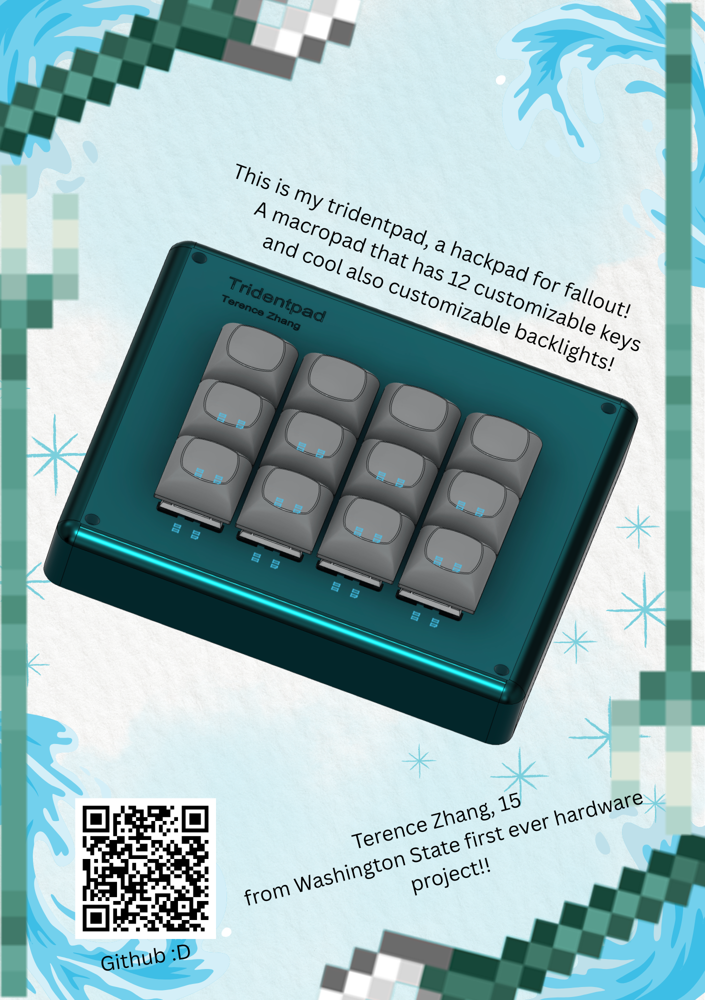
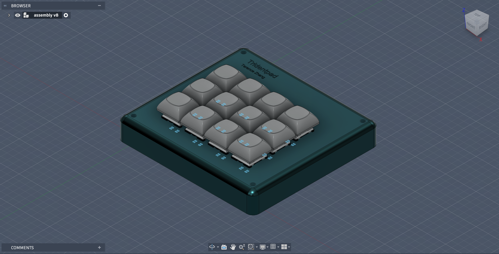
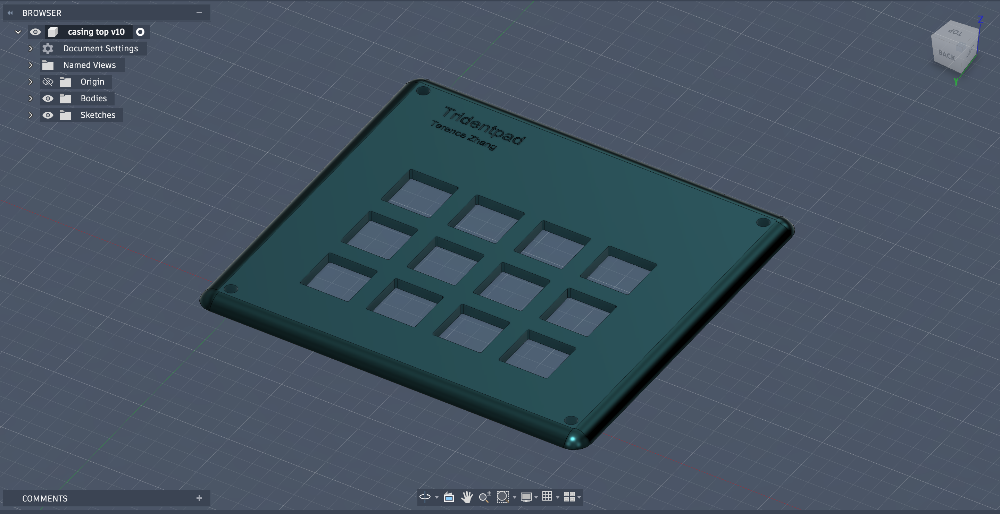
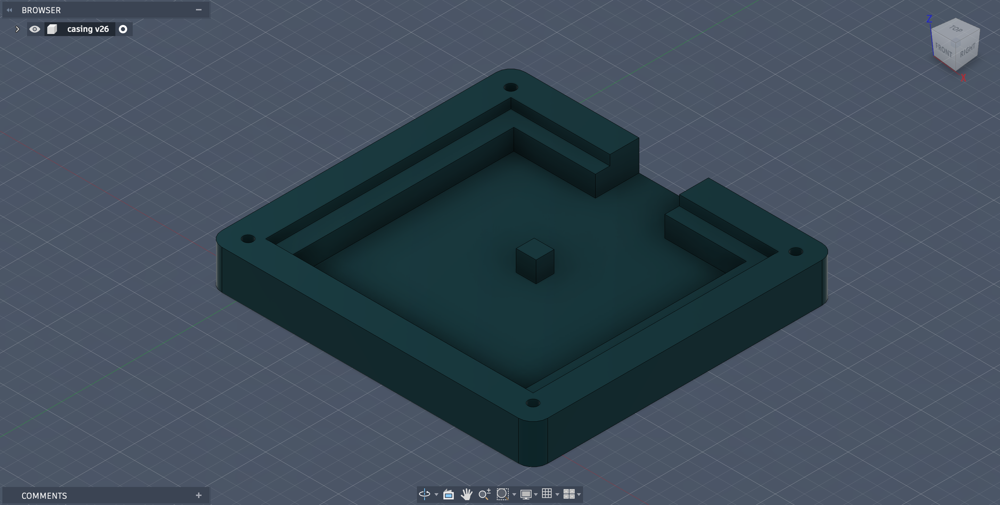

# Tridentpad

The Tridentpad has 12 keys, with each key having a backlight SK6812 MINI-E LEDs, and uses QMK software.

Demo link: https://youtu.be/PokkB0xyun4 

## Zine Poster

## CAD

I loved designing this macropad, and this is my first hardware project from HackClub! This project is mainly for personal use (I haven't really decided yet), and also just as a fun learning project to get started in making hardware projects.

## Schematic 

## PCB

## Firmware

This hackpad uses QMK Firmware to set up the keys and keymap. I will use Vial later to reset the keys, but for now, the keys are simply the left 3x4 letters on a keyboard.

## Case

The case is connected with 4x M3x16mm Screws and 4x M3x5mx4mm heatset insert. The case is printed in two parts and held together with the screws and inserts.

## Assembly

Assembly

https://github.com/user-attachments/assets/bcddb715-b996-4dae-9dc9-fb0daacc86bf

Unassembly

https://github.com/user-attachments/assets/65befd96-f695-466a-b2bf-0598ded5cfb7

## BOM

Everything you need to make this hackpad!
The BOM are in the files.

### Components

- PCB x1
- Seeed XIAO RP2040 x1
- MX-Style switches x12
- 1N4148 Diodes x12
- DSA keycaps x12
- SK6812 MINI-E LED x12
- M3x16mm screw x4
- M3x5mx4mm heatset insert x4
- Case, two parts

