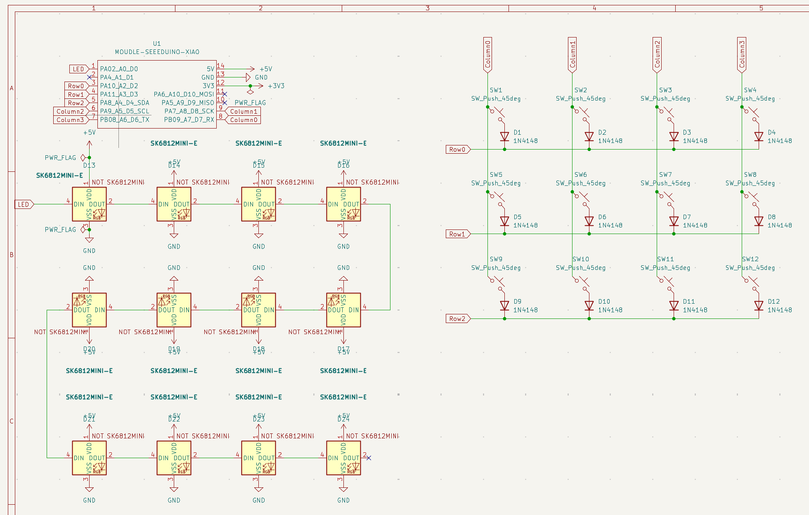
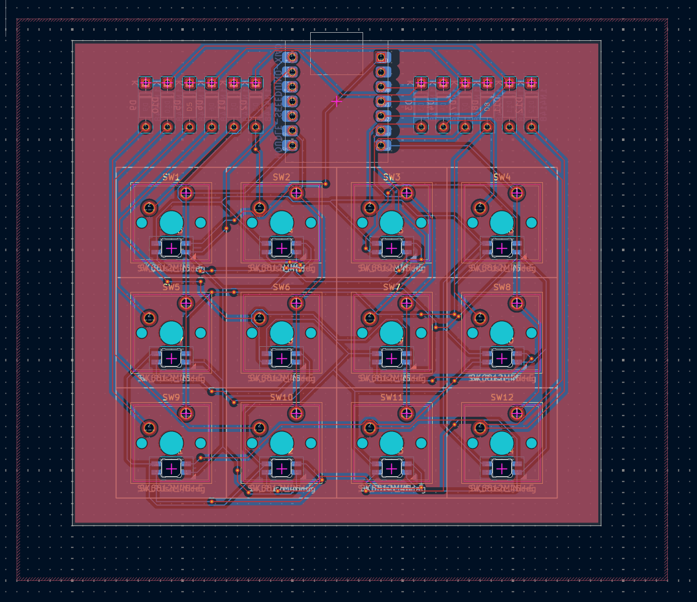

# Tridentpad

The Tridentpad has 12 keys, with each key having a backlight SK6812 MINI-E LEDs, and uses QMK software.

## CAD

## Schematic 

## PCB

## Firmware

## Case

## BOM

Everything you need to make this hackpad!

### Components
- 1x Seeed XIAO RP2040
- 12x MX-Style switches
- 12x 1N4148 Diodes
- 12x DSA Key Caps
- 12x SK6812 MINI-E LED
- 4x M3x16mm Screw
- 4x M3x5mx4mm heatset insert
- 1x Case (Two printed parts)
- 1x PCB

